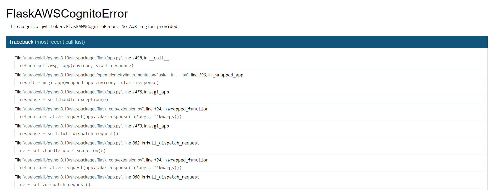
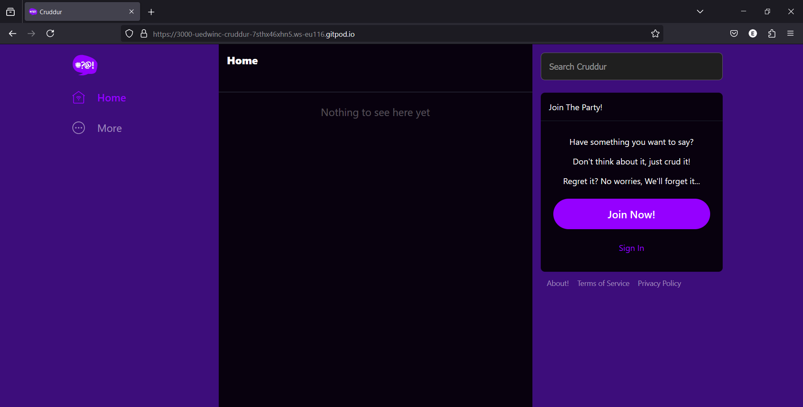

# App Containerization

This can either be done on containers individually or multiple containers using docker-compose

## Containerize Individually

### 1. Containerize Backend

- Build the [Dockerfile](../backend-flask/Dockerfile) (run from /cruddur working directory)

```sh
docker build -t backend-flask ./backend-flask
```

- Run the container

```sh
docker run --rm -p 4567:4567 -it -e FRONTEND_URL='*' -e BACKEND_URL='*' -d backend-flask
```

- Access the backend url link from the ports tab on Gitpod and Confirm on the browser (add `/api/activities/home` endpoint)

> We haven't setup authentication so the backend returns cognito error as shown below:



### 2. Containerize Frontend

- Go to the frontend directory and run `npm install` (This has already been done. Won't be running this to avoid any unknown package upgrade)

- Build the [Dockerfile](../frontend-react-js/Dockerfile) (run from /cruddur working directory)

```sh
docker build -t frontend-react-js ./frontend-react-js
```

- Run container

```sh
docker run -p 3000:3000 -d frontend-react-js
```

- Open Gitpod port link in browser:



## Containerize using Docker Compose

1. `cd` into the working directory containing the [docker-compose](../docker-compose.yml) file

2. Right click on the docker-compose file and click 'Compose up' or do `docker compose up` on the terminal

3. Open the ports and launch on browser

> Note that the docker-compose file include setup for postgres and dynamodb local, as well as aws-xray. We will set these up later. For now, we will comment them out.

---

## Container Security Best Practices

This comprises:
- Docker and host configuration
  - Keep Host & Docker Updated to latest security Patches
  - Docker daemon & containers should run in non-root user mode
- Securing images
  - Image Vulnerability Scanning
  - Trusting a Private vs Public Image Registry
- Secret management
  - No Sensitive Data in Docker files or Images
  - Use Secret Management Services to Share secrets
- Data security
  - Read only File system and Volume for Docker
  - Separate databases for long term storage
- Application security
  - Use DevSecOps practices while building application security
  - Ensure all Code is tested for vulnerabilities before production use
- Monitoring containers
  - Use DevSecOps practices while building application security
  - Ensure all Code is tested for vulnerabilities before production use
- Compliance framework
  - Use DevSecOps practices while building application security
  - Ensure all Code is tested for vulnerabilities before production use

---